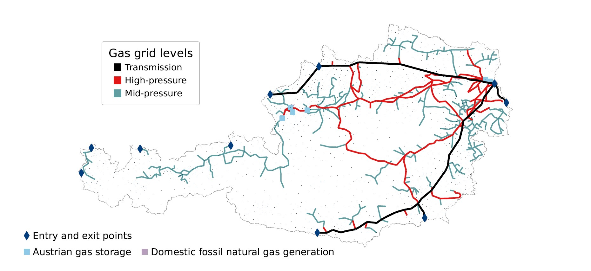

# Modeling insights from the Austrian national gas grid under declining natural gas demand and increasing domestic renewable gas generation by 2040

Copyright (c) 2023 Energy Economics Group (EEG), Technische Universität Wien, Sebastian Zwickl-Bernhard

[//]: 

This repository includes materials and methods of the paper published in _Energy Reports_.

## Overview & Abstract

This paper studies the development of the Austrian gas grid by 2040 under different decarbonization scenarios, ranging from electrifying most energy services to importing large amounts of renewable methane. The Austrian gas grid serves as a case study representative for those gas grids confronted with a drop in natural gas demand and an increase in domestic renewable gas generation in the future. A mixed-integer optimization model with a focus on the detailed representation of the existing grid (gas grid levels, pipeline capacity, route, and age) is used to determine the cost-optimal trade-off decision between expected low-utilized gas pipelines and an off-grid supply alternative (e.g., trucking and on-site gas storage) in a decarbonized Austrian and European energy system. Optimality determines whether to operate, decommission, or make replacement investments in the grid's pipelines. Based on the required gas grid 2040 and its annual grid costs, estimates for tariffs of end customers are given. The paper's main conclusion is that the domestic distributed renewable gas generation uptake will be associated with the need for an area-wide gas grid, but one that will be significantly less utilized. Future work could address, among other things, the exploration of the spatial interplay of local production and demand by forming regional clusters of renewable gas.  
 

    

	

<be>
  
## Data

## Acknowledgement

This work was supported by the Federal Ministry Republic of Republic Austria for Climate Action, Environment, Energy, Mobility, Innovation and Technology under the project Gas-Infra-AT-2040 ("The future role of gas infrastructure in a climate-neutral Austria by 2040"). The content and interpretation of the results of this work do not necessarily reflect the position of the client.

